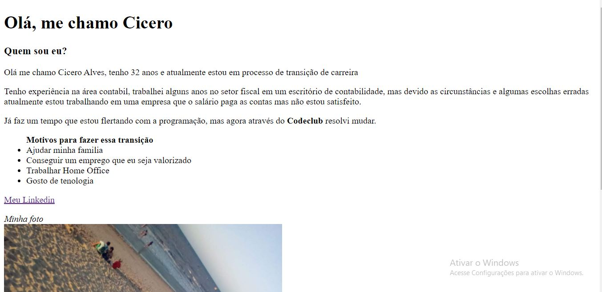
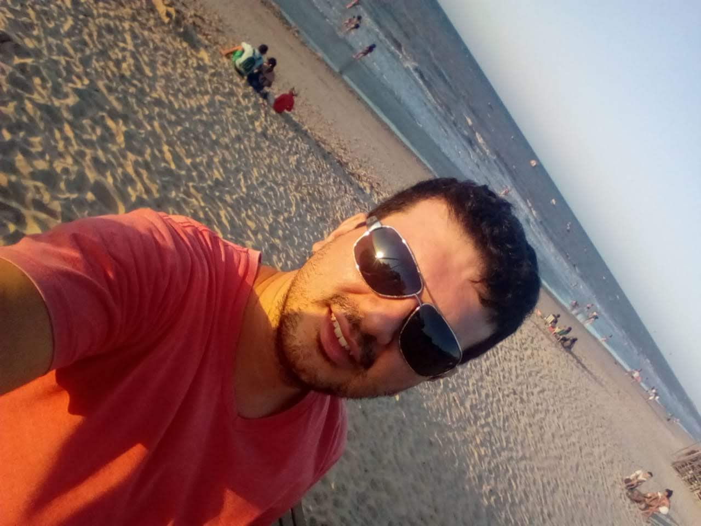

# Minha primeira Web Page

> Web Page falando de mim 😄.

### Ajustes e melhorias

O projeto ainda está em desenvolvimento e as próximas atualizaçõesserão voltadas nas seguintes tarefas:

- [x] HTML
- [ ] CSS
- [ ] Responsividade

## 😄 O que usamos nesse projeto

Meu primeiro contato na vida com programação, então foi apenas HTML. O processo foi bem tranquilo, mas teve uma satisfação de realização bem grande.

## 🤝 Colaboradores

Agradecemos às seguintes pessoas que contribuíram para este projeto:

<table>
  <tr>
    <td align="center">
      <a href="#">
         
        
          <b>Cicero Alves</b>
        
      </a>
</table>
